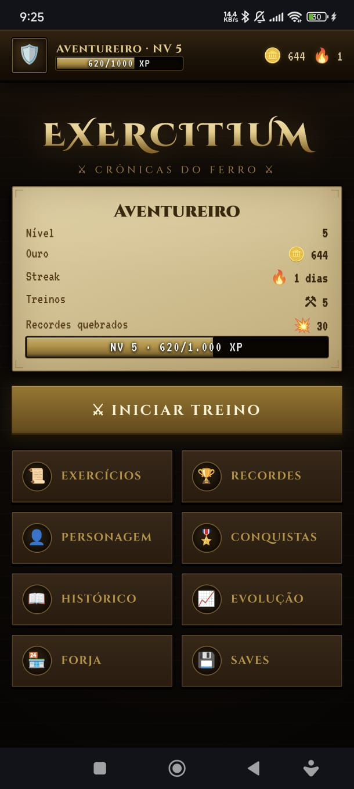
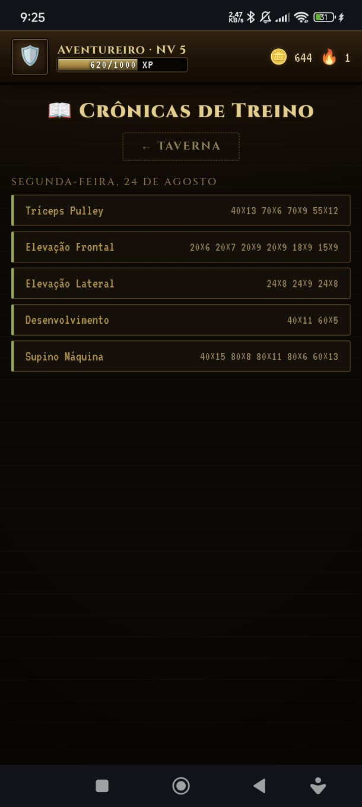
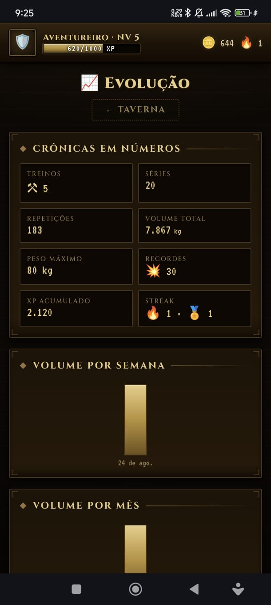
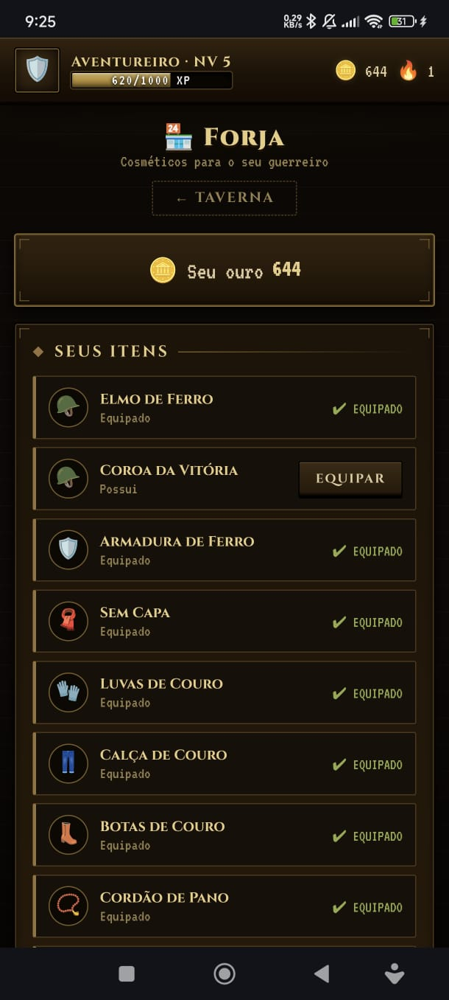
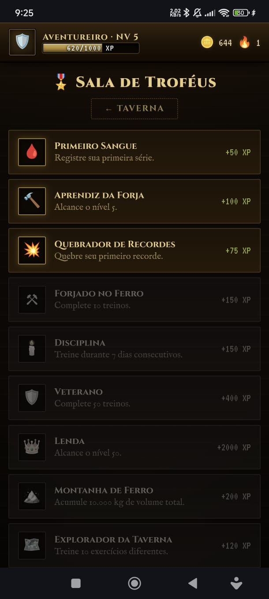
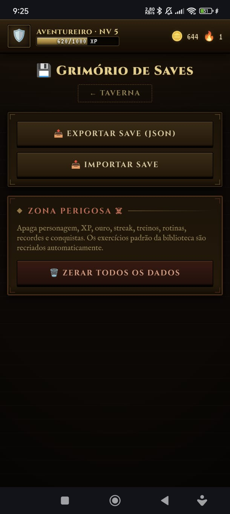

# Exercitium — Crônicas do Ferro

Tracker de treino pessoal transformado em um pequeno RPG medieval retrô.
Escolha exercício → registre séries → ganhe XP → quebre recordes → suba de nível → desbloqueie conquistas.

Não é um sistema de academia: é um save de RPG no qual o treino é a forma de evoluir o personagem.

## Conceito

A interface segue a linguagem de **uma ficha de personagem de RPG medieval antigo**: fundo de pedra escura iluminada por tocha, painéis em madeira e couro com cantos ornamentados em bronze, botões com aparência de metal cinzelado, tipografia medieval legível (Cinzel/Cinzel Decorative para títulos, IM Fell English para texto, VT323 para números).

Na aba **Personagem** há um guerreiro desenhado em SVG cujo corpo cresce conforme os músculos realmente treinados (peito, costas, ombros, braços e pernas são dimensionados pelo histórico), além do **Mapa de Músculos** com vista **frontal e posterior** do corpo: cada grupo macro (Peito, Costas, Ombros, Braços, Pernas, Core) exibe um nível de treino em pips `◆` — I Iniciante, II Desenvolvido, III Avançado, IV Elite — com barra e porcentagem derivadas das séries registradas.

A aba **Evolução** responde "como estou evoluindo?": estatísticas gerais (treinos, séries, repetições, volume, peso máximo, recordes, XP acumulado), gráficos de volume por semana e por mês, volume por grupo muscular e os exercícios mais treinados — cada um com gráfico de peso máximo por sessão no seu detalhe.

Na **Forja 🏪**, o ouro conquistado treinando vira cosméticos para o guerreiro: mais de 40 itens em 8 slots (capacetes, armaduras, capas, luvas, calças, botas, acessórios e armas), organizados por raridade — Comum, Incomum, Raro, Épico e Lendário. O guerreiro fica sempre visível na tela: tocar num item mostra a **prévia ao vivo** nele, com comparação ATUAL vs NOVO antes de confirmar EQUIPAR. Itens de raridade maior mudam a silhueta do personagem (armadura pesada alarga os ombros, elmos com chifres/coroa/capuz mudam a cabeça, capas variam comprimento e cor, e as armas têm formatos próprios: espada, espadão, machado, martelo e lança). Alguns itens são comprados com ouro; outros são desbloqueados por feitos — recordes quebrados, volume acumulado ou treinos completos.

## Screenshots

<table>
  <tr>
    <td align="center"><br><sub><b>Início</b></sub></td>
    <td align="center"><br><sub><b>Ficha do Herói</b></sub></td>
    <td align="center"><br><sub><b>Biblioteca de Exercícios</b></sub></td>
  </tr>
  <tr>
    <td align="center"><br><sub><b>Histórico de Treino</b></sub></td>
    <td align="center"><br><sub><b>Histórico</b></sub></td>
    <td align="center"><br><sub><b>Evolução</b></sub></td>
  </tr>
  <tr>
    <td align="center"><br><sub><b>Mapa de Músculos</b></sub></td>
    <td align="center"><br><sub><b>Forja</b></sub></td>
    <td align="center"><br><sub><b>Troféus</b></sub></td>
  </tr>
  <tr>
    <td colspan="3" align="center"><br><sub><b>Saves</b></sub></td>
  </tr>
</table>

## Estrutura

```
index.html   estrutura das telas
style.css    identidade visual RPG medieval retrô
data.js      biblioteca padrão de exercícios + conquistas + curva de XP
state.js     estado e persistência (localStorage), CRUDs, export/import
game.js      regras de jogo (XP, níveis, recordes, streak, conquistas)
warrior.js   guerreiro visual em SVG + mapa de músculos (derivados do histórico)
ui.js        telas, fluxos e feedback visual
```

Tecnologias:

- HTML5, CSS3 e JavaScript puros (sem frameworks, sem dependências)
- Persistência via `localStorage`
- Fontes Google Fonts (Cinzel, IM Fell English, VT323)

## Características

- **Treinos pré-definidos**: crie rotinas reutilizáveis (nome, exercícios em ordem, séries planejadas por exercício) e execute-as com avanço automático
- **Treino livre**: adicione qualquer exercício na hora e registre quantas séries quiser
- **Salvamento automático do treino em andamento**: cada série registrada é persistida imediatamente no `localStorage` (`status: in_progress`); se a página for atualizada ou fechada, o treino pode ser continuado ou descartado a partir da tela inicial
- **Cooldown de 10 segundos** entre séries registradas, com contador visível e proteção também na lógica (não apenas visual)
- **Rotina como guia**: pule exercícios, volte atrás, faça séries extras e adicione exercícios não planejados — tudo conta normalmente para XP, volume e recordes
- **Pré-preenchimento inteligente**: os campos de peso/repetições vêm preenchidos com a última performance do exercício
- **Biblioteca de exercícios** com 39 exercícios populares (músculos principais e secundários já definidos) + criação de exercícios personalizados
- **Sistema de RPG**: XP com curva progressiva, níveis, ouro, streak de dias treinados
- **Recordes automáticos**: maior peso, mais repetições, melhor série e maior volume de treino, com celebração ao quebrar
- **Conquistas** desbloqueáveis registradas permanentemente
- **Ficha do personagem** com estatísticas derivadas (FORÇA, VIGOR, DISCIPLINA)
- **Exportar/Importar save** em JSON, como um save de videogame
- **Zerar todos os dados** com confirmação explícita (a biblioteca padrão é recriada automaticamente)

## Como rodar

Abra `index.html` no navegador — funciona 100% offline, sem backend.

Ou, se preferir servir localmente:

```bash
python3 -m http.server 8080
```

## Licença

Livre para usar, modificar, distribuir e fazer o que quiser — sem garantias.
